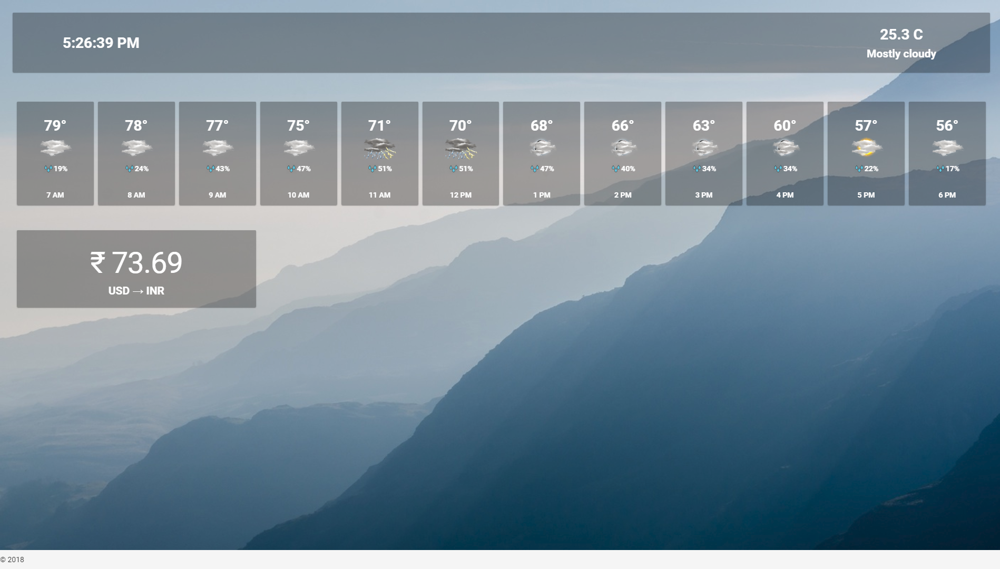

# MyriadDashboard

Simple web dashboard with mutiple services.
Built on Vue.js and Vuetify

## Overview
Provides a dashboard with vital information like Weather, Train/Bus time etc which helps in day-to-day management.
The data is represented as cards

The following information is available now:
1) Weather (12 hours forceast)
2) Currency Value

## Installation
Coming soon....

## Cofiguration
The file config.js file (webapp/src/config/) contains configuration data like API keys. Add your api keys in this file. 

## APIs
Details about API used:
1. Weather
  * Data Source: AccuWeather
  * You can get the api key by registering on their website
  * Use this url to get your location key (api key needed): https://developer.accuweather.com/accuweather-locations-api/apis/get/locations/v1/cities/search
  * Give your zipcode for 'q' in the request
  * More information on AccuWeather api : https://developer.accuweather.com/apis 

2. Currency Value
  * Data Source: https://www.currencyconverterapi.com/
  * This API doesn't need an API key
  * Change the to and from values in config.js file
  
  
